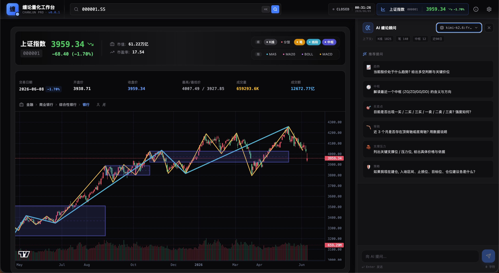

<div align="center">

# ChanLun Stock Analyzer

### 缠论量化工作台 · AI-Powered ChanLun Technical Analysis Platform

[](https://react.dev)
[](https://www.typescriptlang.org)
[](https://vitejs.dev)
[](https://tailwindcss.com)
[](LICENSE)

</div>

---

## Screenshot

<div align="center">



</div>

---

## English

### Overview

ChanLun Stock Analyzer is a professional A-share technical analysis platform built on **ChanLun (缠论)** theory. It automatically identifies core market structures — fractions (分型), strokes (笔), segments (线段), and hubs (中枢) — and combines AI-powered multi-factor analysis to help traders objectively understand market trends, locate key support/resistance levels, and identify potential buy/sell signals.

### Key Features

- **ChanLun Structure Recognition** — Automatic identification of top/bottom fractions, strokes, segments, and multi-level hubs following the original ChanLun definitions
- **Buy/Sell Point & Divergence Detection** — Identifies 1st/2nd/3rd buy/sell points and top/bottom divergences with structured trading signals
- **AI Multi-Factor Analysis** — Powered by Google Gemini or OpenRouter, injects complete structured context into prompts for professional Chinese quantitative reports
- **Technical Indicators** — MA5/MA20, Bollinger Bands, MACD with interactive chart overlays
- **Stock Info Panel** — Displays industry, actual controller, and reduction plan announcements
- **Backtest Manager** — Local browser-persisted backtest tasks with Supabase cloud sync for logged-in users
- **Search History** — Persistent stock search history with preset quick-access stocks
- **Resizable AI Rail** — Draggable side panel with persistent width, responsive mobile layout
- **Dark Theme** — Polished dark UI with smooth animations

### Tech Stack

| Layer | Technology |
|-------|-----------|
| Framework | React 19 + TypeScript 5.8 |
| Build | Vite 6 + Tailwind CSS 4 |
| Charting | Lightweight Charts (TradingView) |
| Visualization | D3.js + Recharts |
| Icons & Motion | Lucide React + Motion |
| AI | Google Gemini / OpenRouter |
| Data | TickFlow API (free tier available) |
| Auth & DB | Supabase |

### Getting Started

**Prerequisites:** Node.js 18+

1. **Clone the repository**
   ```bash
   git clone https://github.com/huhk345/chanlun-stock-analyzer.git
   cd chanlun-stock-analyzer
   ```

2. **Install dependencies**
   ```bash
   npm install
   ```

3. **Configure environment variables** — Copy `.env.example` to `.env.local` and fill in your API keys:
   ```bash
   cp .env.example .env.local
   ```
   | Variable | Required | Description |
   |----------|----------|-------------|
   | `VITE_TICKFLOW_API_KEY` | No | TickFlow API key (free tier works without key) |
   | `VITE_GEMINI_API_KEY` | Yes | Google Gemini API key from [AI Studio](https://aistudio.google.com/app/apikey) |
   | `VITE_OPENROUTER_API_KEY` | No | OpenRouter API key for multi-model support |

4. **Run the development server**
   ```bash
   npm run dev
   ```

5. Open [http://localhost:5173](http://localhost:5173) in your browser.

### Usage

1. Enter a stock code (e.g., `600519` for Kweichow Moutai) in the search bar
2. The chart automatically processes: K-line inclusion merging → fraction detection → stroke calculation → segment extraction → hub identification
3. Toggle overlays: strokes, segments, hubs, fractions, MA, Bollinger Bands, MACD
4. Use the AI Advisor panel on the right to ask questions about trends, buy/sell points, divergences, and strategies
5. Configure API keys via the Settings modal (gear icon)

### Keywords

`ChanLun` `缠论` `Technical Analysis` `Stock Analysis` `A-Share` `Fraction` `Stroke` `Segment` `Hub` `Divergence` `Buy/Sell Points` `AI Analysis` `Gemini` `OpenRouter` `Lightweight Charts` `React` `TypeScript` `Vite` `Tailwind CSS` `Quantitative Trading`

---

## 中文

### 项目简介

缠论量化工作台是一款基于 **缠论 (ChanLun)** 理论构建的 A 股技术分析平台。通过自动识别分型、笔、线段、中枢等核心结构, 结合 AI 大模型进行多因子量化解读, 帮助交易者客观理解市场走势、定位关键支撑压力位并识别潜在买卖点。

### 核心功能

- **缠论结构识别** — 严格遵循缠论原始定义, 自动识别顶底分型、连接成笔、合并笔为线段、并提取多级别中枢结构
- **买卖点与背驰识别** — 基于一买 / 二买 / 三买与对应卖点判定, 自动检测顶底背驰, 输出可执行的结构化交易信号
- **AI 多因子分析** — 通过 Google Gemini 或 OpenRouter 路由, 将完整结构化上下文注入提示词, 输出专业中文量化报告
- **技术指标叠加** — MA5/MA20 均线、布林带、MACD, 可交互式叠加到 K 线图上
- **股票信息面板** — 展示行业、实际控制人、减持计划公告等关键信息
- **回测管理器** — 本地浏览器持久化回测任务, 支持 Supabase 云端账户同步
- **搜索历史** — 持久化股票搜索记录, 预设热门股票快速访问
- **可调整 AI 侧栏** — 可拖拽调整宽度的 AI 顾问面板, 移动端自适应布局
- **暗色主题** — 精致暗色 UI, 流畅动效

### 技术栈

| 层级 | 技术 |
|------|------|
| 框架 | React 19 + TypeScript 5.8 |
| 构建 | Vite 6 + Tailwind CSS 4 |
| 图表 | Lightweight Charts (TradingView) |
| 可视化 | D3.js + Recharts |
| 图标与动效 | Lucide React + Motion |
| AI | Google Gemini / OpenRouter |
| 数据 | TickFlow API (提供免费接口) |
| 认证与数据库 | Supabase |

### 快速开始

**前置条件:** Node.js 18+

1. **克隆仓库**
   ```bash
   git clone https://github.com/huhk345/chanlun-stock-analyzer.git
   cd chanlun-stock-analyzer
   ```

2. **安装依赖**
   ```bash
   npm install
   ```

3. **配置环境变量** — 将 `.env.example` 复制为 `.env.local` 并填入 API Key:
   ```bash
   cp .env.example .env.local
   ```
   | 变量 | 是否必须 | 说明 |
   |------|----------|------|
   | `VITE_TICKFLOW_API_KEY` | 否 | TickFlow API Key (不提供则使用免费接口) |
   | `VITE_GEMINI_API_KEY` | 是 | Google Gemini API Key, 从 [AI Studio](https://aistudio.google.com/app/apikey) 获取 |
   | `VITE_OPENROUTER_API_KEY` | 否 | OpenRouter API Key, 支持多种 AI 模型 |

4. **启动开发服务器**
   ```bash
   npm run dev
   ```

5. 在浏览器中打开 [http://localhost:5173](http://localhost:5173)

### 使用方法

1. 在搜索栏输入股票代码 (如 `600519` 贵州茅台)
2. 图表自动处理: K线包含关系合并 → 分型检测 → 笔的计算 → 线段提取 → 中枢识别
3. 切换叠加层: 笔、线段、中枢、分型、均线、布林带、MACD
4. 使用右侧 AI 顾问面板, 提问趋势、买卖点、背驰、策略等问题
5. 通过设置弹窗 (齿轮图标) 配置 API Key

### 关键词

`缠论` `ChanLun` `技术分析` `股票分析` `A股` `分型` `笔` `线段` `中枢` `背驰` `买卖点` `AI分析` `Gemini` `OpenRouter` `Lightweight Charts` `React` `TypeScript` `Vite` `Tailwind CSS` `量化交易`

---

## Disclaimer

This tool is for educational and research purposes only. It does not constitute any investment advice. Investment involves risk; please exercise caution.

本工具仅供学习研究使用, 不构成任何投资建议, 投资有风险, 入市需谨慎。
